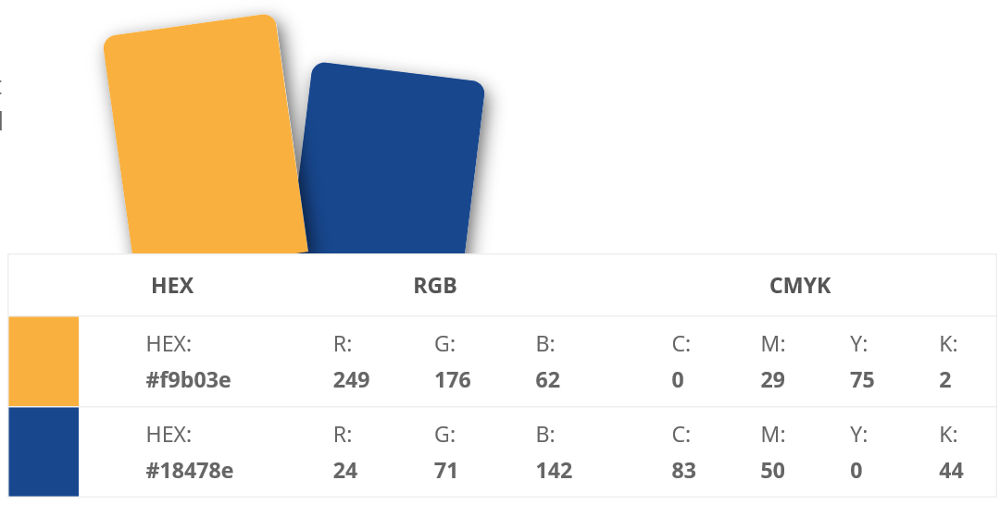

<a href="https://shyan1943.github.io/Project1/">
 
 
## Welcome to my first B2B website!!! 

Weblink --> https://shyan1943.github.io/Project1/ or you may click on the above logo to direct you to my website 
 
  
 
Happy reading!

--------
### 1) STRATERY 

1a) Business Objective : Enchance branding 

1b) Target audience : Shipper & Freight Forwarder and next generation
     
1c) Customer Goals : Use the most efficient and comfortable way to know more about their vendor. In terms of vendor's services, professionalism, accessibility, reliability, trustworthy and etc... that can help to solve their daily shipping problem. 

1d) With consideration on point 1a~1c, Business owner will focus on how to attract and communicate with the <a href="https://www.chartcourse.com/communicating-four-disc-styles/">Four DISC personaility styles </a> concept in UI/UX, so that different group of site visitors can receive the information they wanted in the fastest and most effective way. To achieve a win-win effect. 
 
 
### 2) SCOPE - User story with Epic

2a) As a site visitor "DOMINANT", I want gets straight to the point what are the services provided, so that I can contact with the right vendor. // 2a.Epic1) I want to look for a professional freight forwarder, so that my consignment can reach the buyer's premises without giving me any problem. // 2a.Epic2) I'm busy, I want straight away click and phone out to reach my vendor (accessibility), so that I do not need to fill up my particulars or remember & press again vendor contact number before reaching them, and straight away I connect with a real person. 
	
2b) As a site visitor "INFLUENTIAL", I want see something that is new, outstanding and attractive, so that it can cheer up my days. // 2b.Epic1) I want to coorperate with the people who are focusing on the positive and future, so that I can enjoy the shipping process every moment. // 2b.Epic2) I want to deal with someone who is openness and direct, so that do not overloading me with details. 

2c) As a site visitor "CONSCIENTIOUS", I want to know more about your company background, so that I feel more protection and can have a peace of mind while using your services. // 2c.Epic1) I want my vendors are well-trained and professional, so that my shipment are well-organized and done perfectly. // 2c.Epic2) I want to ensure my vendors are stable and insured, so that we are under the protection if anything happen.   

2d) As a "younger next generation" site visitor, I want get any information I wanted through internet without making a phone call, so that I get the information anytime anywhere. // 2d.Epic1) I want something out of traditional, so that i feel they are new and keep improving. // 2d.Epic2) i want to communicate with my vendor through apps chat or email instead of making phone call, so that i feel more convenience and they are more advanced.   
 
 
### 3) STRUCTURE

#### 3a) Information Architecture

#### 3b) Interaction Design

Our website behave more like people. A system has with its users all the time. Make users feel like its a natural conversation with real person. When clicking something, they get back something. 

Just like our fixed-top navigation bar, users can click on it and get what users want immediately, instead of by scrolling-up to the top or still have to click a scroll up button. 

Another example is our contact functions. Users can choose their most comfortable way by simply click on "call us", "email us", "whatsapp us" to get in touch with us immediately. Rather than filing up the particulars, submit and wait for our reply.  
 
 
### 4) SKELETON

#### 4a) Interface design 

This is a responsive website, which users can view, get the same information & reach us by using difference IT products. Also, In a world where users are constantly bombarded with too much content, people love simplicity. With this, we design it as an "One-page websites" offer a fast and clear reading experience. 

#### 4b) Navigation design 

I use the concept "simplify option", so it's very clear where to click on. A "fixed-top" navigation bar is designed for user's convenience from one page to another easily. I also implement the hover function, so users know its clickable when mouse over. By clicking the "call us", "email us" or "whatsapp us" button, it can straight a way bring the user to the call function without typing our number, create a new email without typing our email address and even go direct to the whatsapp chatting page without typing & saving our contact before reaching us. 
 
#### 4c) Information Design
It means that the presentation of information in a way that facilitates understanding. I make use of the carousel slideshow at the landing page by presenting the related pictures, it straight away transmit a message to the site visitor that we are providing shipping & logistics services. In our services page, instead of writing a full paragraph to telling people what we are providing, we use the picture to represent a thousand words. Just mouse over at the services picture without clicking, an animation transition performs to give a short and shape introduction of the services. 
 
 
### 5) SURFACE

One of my visual design is to standardize the font to one only "Poppins, serif". Also, trying to keep the color skin in blue & gold to match with the logo color. lastly are the photo choosing, it must be able to transmit business goal message, easy understand and matching our theme color. 
 
 
### 6) TESTING

#### 6a) Validating Markup : 
All pages validated using W3 Markup Validation Service (http://validator.w3.org/). Document checking completed. No errors or warnings to show.

#### 6b) Hyperlink Check : 
All pages checked using W3C Link Checker (https://validator.w3.org/checklink). The result show there are errors with linking to call, fax, email or whatsapp. However, if I tested on the laptop or mobile, which have the call, email or whatsapp function it will run well. 

#### 6c) Navigation Check :
Clicked on each of the navigation on every page and ensure they linked to the right place. 
Clicked on each of the carousel photo navigation and the previous and next page (whenever is active) on every page and ensure they linked to the right place.
 
 
### 7) DEPLOYMENT 

#### 7a) Preparation

Before the site goes 'live':

#### Content
•	Be clear what business owner wanted to focus on.

•	Fixed font (https://fonts.google.com).

•	Fixed color code (https://www.sessions.edu/color-calculator/).

•	Choose the photos (https://unsplash.com/) which are related to the project theme and color matching. 

•	Set up Github repository and Visual Studio Code.

•	Ensured Visual Studio Code is upstream to Github before start coding. 

•	Ensured all the last changes are saved and committed.

•	Did a Git Push.

#### 7b) Production

Putting the site into production.

#### Git Pages

•	At the Git Repository, I navigate to the 'Setting'

•	I scrolled down to the Git Pages section.

•	Select 'master branch'

•	View and test the site at https://shyan1943.github.io/Project1/

--------

Thank you so much for your time and attention. 

Thanks

Shyan

TEL: +65 9248 5656 
						

